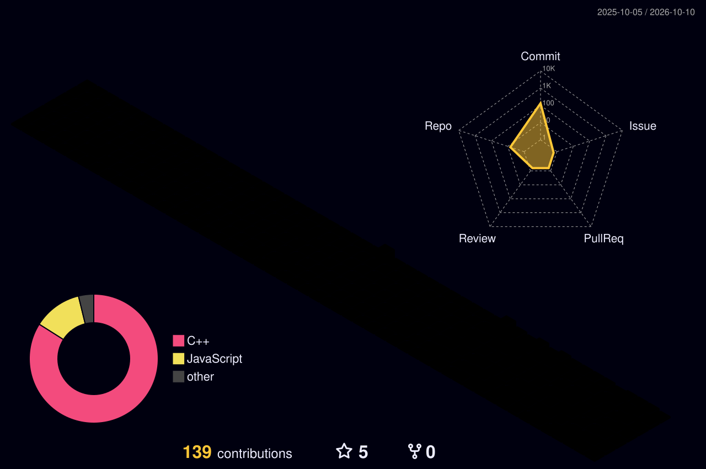

About Me

Hi, I'm Ronak Sevak — a Computer Science student and aspiring Software Engineer who enjoys turning ideas into scalable, real-world applications.

I’m focused on Full-Stack Development, Data Structures & Algorithms, Backend Engineering, and AI-powered applications. I believe in learning by building, which has led me to work on multiple projects across web development and AI.

🚀 What I Do

- ⚡ Build full-stack applications using the MERN Stack
- 🧩 Solve 250+ Data Structures & Algorithms problems and continuously strengthen my problem-solving skills
- 🛠️ Develop and deploy real-world projects with modern web technologies
- 🤖 Explore the integration of AI/GenAI with full-stack applications
- 🗄️ Work with both SQL & NoSQL databases
- ⚙️ Build a strong foundation in Operating Systems, DBMS, OOP, and Computer Science fundamentals
- 🔄 Practice writing clean, efficient, and maintainable code

🧠 Technical Focus

Languages:
"C++" "Python" "JavaScript"

Frontend:
"HTML" "CSS" "React.js" "Next.js" "Vite"

Backend:
"Node.js" "Express.js" "REST APIs"

Databases:
"MongoDB" "SQL" "SQLite"

Core CS:
"DSA" "Operating Systems" "DBMS" "OOP" "Computer Networks"

Tools & Platforms:
"Git" "GitHub" "VS Code" "Vercel"

📌 Currently

🔹 Improving my DSA & competitive problem-solving skills
🔹 Building and refining full-stack projects
🔹 Exploring AI-integrated web applications
🔹 Deepening my understanding of backend systems and CS fundamentals

🎯 My Goal

To become a well-rounded Software Engineer capable of designing, developing, and deploying reliable software — from efficient algorithms and backend architecture to polished user experiences.

«Build consistently. Solve intelligently. Learn relentlessly. 🚀»

🌐 Socials:

svg

Instagram (image) LinkedIn (image) [Mastodon](https://mastodon.social/@Ronak Sevak) email (image)

💻 Tech Stack:

svg

C++ HTML5 CSS3 JavaScript TypeScript Python PowerShell GraphQL Windows Terminal Zig Alibaba Cloud AWS Azure Cloudflare Codeberg Datadog Render Vultr Vercel Scaleway Google Cloud Netlify Oracle Express.js FastAPI Fastify Flask Ionic JWT NPM Next JS NodeJS Nodemon Redux React Hook Form React Router React Query React SASS Semantic UI React Socket.io Strapi Styled Components Vite Web3.js Webpack TailwindCSS Spring Context-API Bootstrap Code-Igniter JavaFX Jinja Joomla Laravel Less OpenCV Apache Apache Flink Apache Maven Apache Tomcat Nginx Apache Ant OpenStack Linode Type-graphql Esbuild AmazonDynamoDB Supabase SQLite MongoDB MySQL Postgres Firebase Redis Prisma Single Store Sequelize ApacheCassandra Arango DB CockroachLabs Adobe Adobe Acrobat Reader Adobe After Effects Adobe Audition Adobe Creative Cloud Adobe Lightroom Adobe InDesign Adobe Illustrator Adobe Lightroom Classic Krita Proto.io Canva Blender Sketch Sketch Up Dribbble Figma Framer Matplotlib NumPy Pandas Scipy PyTorch GitLab CI GitHub Actions GitHub Gitee Gitea Git GitLab CloudBees Puppeteer Selenium Sentry Testing-Library Jest Arduino Docker Kubernetes Notion PlatformIO Portfolio Postman Power Bi Prettier Raspberry Pi Uber Vagrant AMD Analogue Battle.net Bevy Epic Games Godot Engine nVIDIA OpenGL Humble Bundle Itch.io PlayStation Network Steam Xbox Ubisoft

📊 GitHub Stats:

svg

image
image
image

image (image)

 

<h2 align="center">📊 My GitHub Contributions</h2>

  

